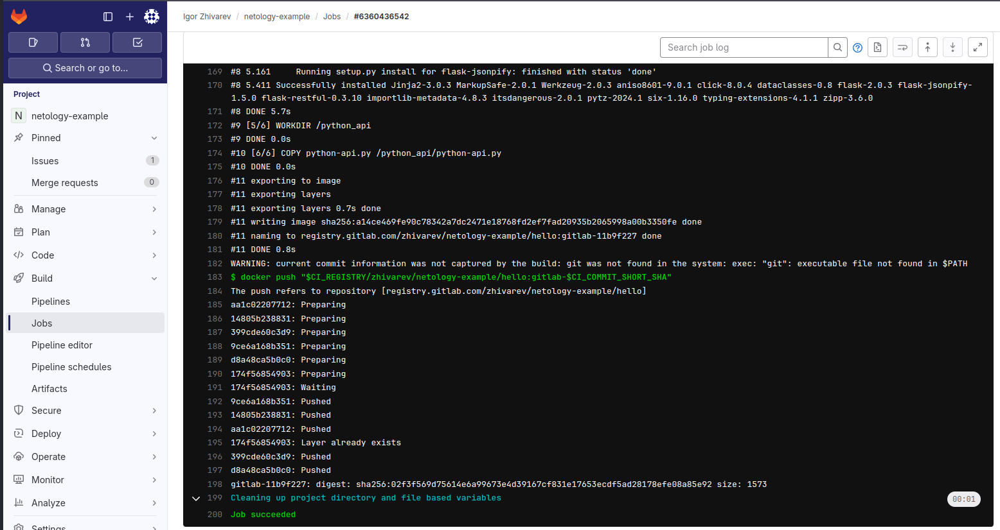
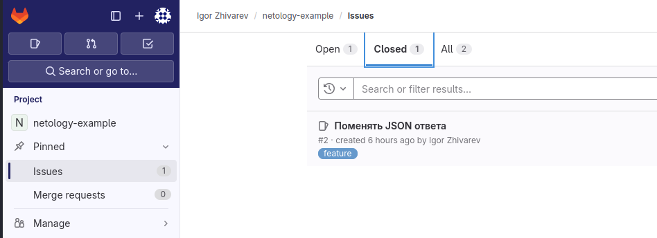
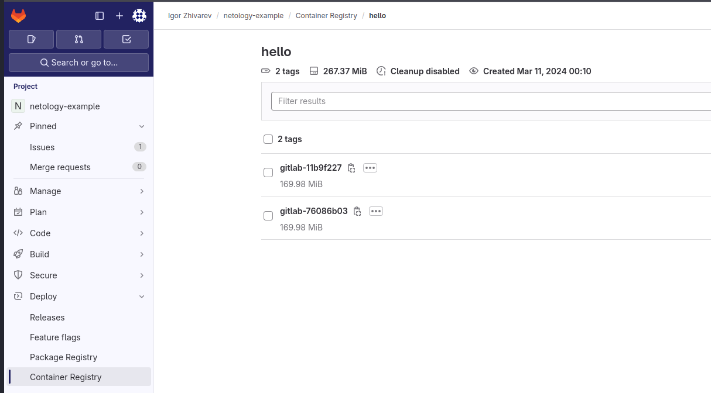
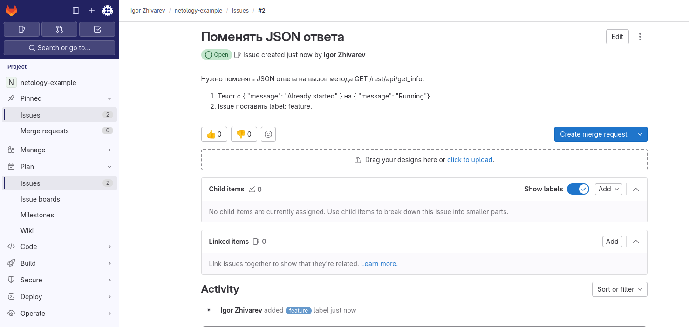
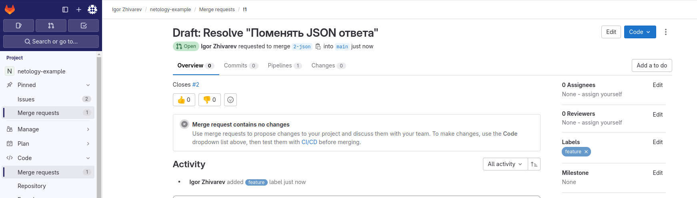
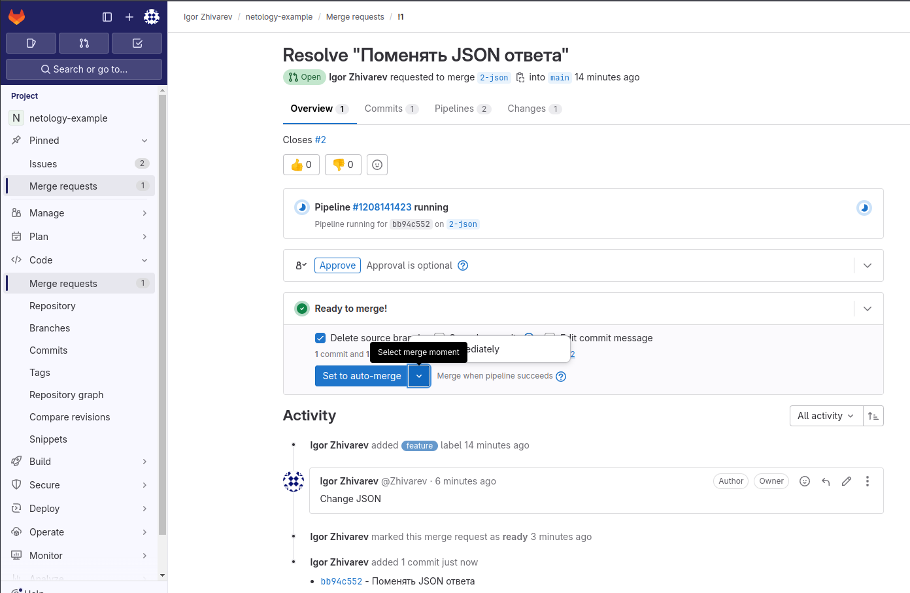
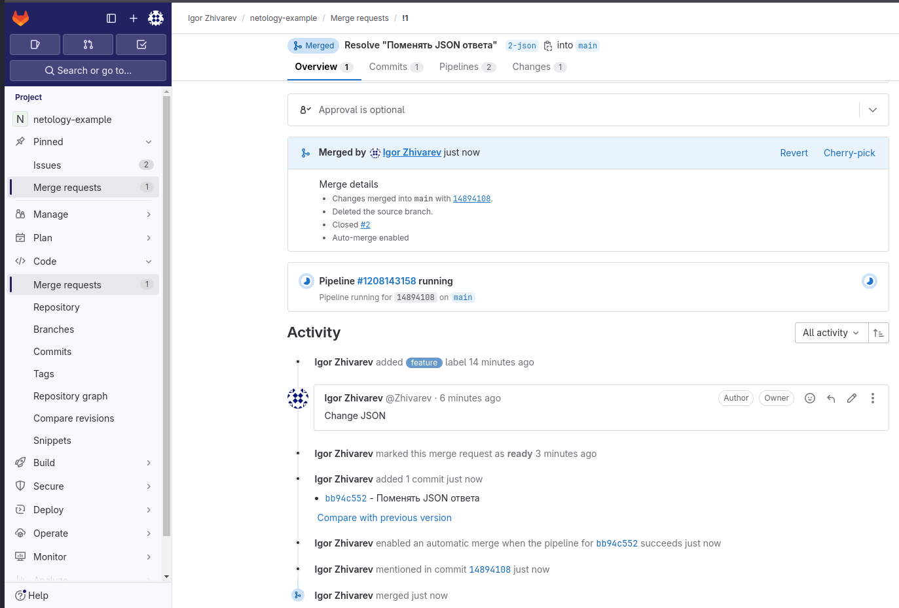
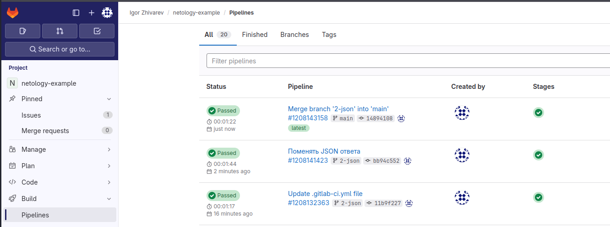
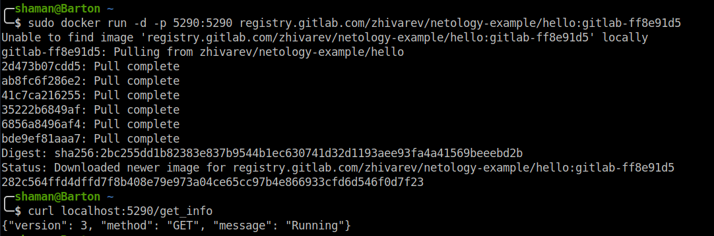

# Домашнее задание к занятию 12 «`GitLab`» - `Живарев Игорь`


## Подготовка к выполнению


1. Или подготовьте к работе Managed GitLab от yandex cloud [по инструкции](https://cloud.yandex.ru/docs/managed-gitlab/operations/instance/instance-create) .
Или создайте виртуальную машину из публичного образа [по инструкции](https://cloud.yandex.ru/marketplace/products/yc/gitlab ) .
2. Создайте виртуальную машину и установите на нее gitlab runner, подключите к вашему серверу gitlab  [по инструкции](https://docs.gitlab.com/runner/install/linux-repository.html) .

3. (* Необязательное задание повышенной сложности. )  Если вы уже знакомы с k8s попробуйте выполнить задание, запустив gitlab server и gitlab runner в k8s  [по инструкции](https://cloud.yandex.ru/docs/tutorials/infrastructure-management/gitlab-containers). 

4. Создайте свой новый проект.
5. Создайте новый репозиторий в GitLab, наполните его [файлами](./repository).
6. Проект должен быть публичным, остальные настройки по желанию.

## Основная часть

### DevOps

В репозитории содержится код проекта на Python. Проект — RESTful API сервис. Ваша задача — автоматизировать сборку образа с выполнением python-скрипта:

1. Образ собирается на основе [centos:7](https://hub.docker.com/_/centos?tab=tags&page=1&ordering=last_updated).
2. Python версии не ниже 3.7.
3. Установлены зависимости: `flask` `flask-jsonpify` `flask-restful`.
4. Создана директория `/python_api`.
5. Скрипт из репозитория размещён в /python_api.
6. Точка вызова: запуск скрипта.
7. При комите в любую ветку должен собираться docker image с форматом имени hello:gitlab-$CI_COMMIT_SHORT_SHA . Образ должен быть выложен в Gitlab registry или yandex registry.   

### Product Owner

Вашему проекту нужна бизнесовая доработка: нужно поменять JSON ответа на вызов метода GET `/rest/api/get_info`, необходимо создать Issue в котором указать:

1. Какой метод необходимо исправить.
2. Текст с `{ "message": "Already started" }` на `{ "message": "Running"}`.
3. Issue поставить label: feature.

### Developer

Пришёл новый Issue на доработку, вам нужно:

1. Создать отдельную ветку, связанную с этим Issue.
2. Внести изменения по тексту из задания.
3. Подготовить Merge Request, влить необходимые изменения в `master`, проверить, что сборка прошла успешно.


### Tester

Разработчики выполнили новый Issue, необходимо проверить валидность изменений:

1. Поднять докер-контейнер с образом `python-api:latest` и проверить возврат метода на корректность.
2. Закрыть Issue с комментарием об успешности прохождения, указав желаемый результат и фактически достигнутый.

## Итог

В качестве ответа пришлите подробные скриншоты по каждому пункту задания:

- файл gitlab-ci.yml;
- Dockerfile; 
- лог успешного выполнения пайплайна;
- решённый Issue.

### Важно 
После выполнения задания выключите и удалите все задействованные ресурсы в Yandex Cloud.
---


## Ответы


файл gitlab-ci.yml

```
docker-build:
  # Use the official docker image.
  image: docker:cli
  stage: build
  services:
    - docker:dind
  variables:
    DOCKER_IMAGE_NAME: $CI_REGISTRY_IMAGE:$CI_COMMIT_REF_SLUG
  before_script:
    - docker login -u "$CI_REGISTRY_USER" -p "$CI_REGISTRY_PASSWORD" $CI_REGISTRY
  # All branches are tagged with $DOCKER_IMAGE_NAME (defaults to commit ref slug)
  # Default branch is also tagged with `latest`
  script:
    - docker build --pull -t "$CI_REGISTRY/zhivarev/netology-example/hello:gitlab-$CI_COMMIT_SHORT_SHA" .
    - docker push "$CI_REGISTRY/zhivarev/netology-example/hello:gitlab-$CI_COMMIT_SHORT_SHA"
#    - docker push "$DOCKER_IMAGE_NAME"
  # Run this job in a branch where a Dockerfile exists
  rules:
    - if: $CI_COMMIT_BRANCH
      exists:
        - Dockerfile

```

Dockerfile

```
FROM centos:7
RUN yum install python3 python3-pip -y
COPY requirements.txt requirements.txt
RUN pip3 install -r requirements.txt
WORKDIR /python_api
COPY python-api.py /python_api/python-api.py
CMD ["python3", "python-api.py"]
```

лог успешного выполнения пайплайна



решённый Issue



---

При комите в любую ветку должен собираться docker image с форматом имени hello:gitlab-$CI_COMMIT_SHORT_SHA . Образ должен быть выложен в Gitlab registry или yandex registry.




Вашему проекту нужна бизнесовая доработка: нужно поменять JSON ответа на вызов метода GET `/rest/api/get_info`, необходимо создать Issue.




Создать отдельную ветку, связанную с этим Issue.




Подготовить Merge Request,




влить необходимые изменения в `maste`r,




проверить, что сборка прошла успешно




Поднять докер-контейнер с образом python-api:latest и проверить возврат метода на корректность.




Закрыть Issue с комментарием об успешности прохождения, указав желаемый результат и фактически достигнутый.


---
